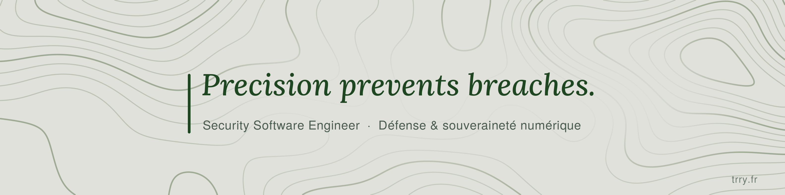

  

  Un pare-feu configuré ne garantit pas que le réseau est cloisonné. 
  Un correctif installé ne garantit pas que la faille est fermée. 
  <b>J'écris des outils qui vérifient ce qu'un système fait réellement.</b>

  
  
  

Étudiant en 3ᵉ année de cybersécurité à l'ESGI, en alternance dans l'infrastructure et la sécurité. Je cherche une alternance de Mastère dès janvier 2027 (1 semaine école, 3 semaines entreprise), dans la défense et la souveraineté numérique, en développement d'outils de sécurité ou en reverse engineering.

## Dépôts publics

| | Ce qu'il fait |
|---|---|
| [**Argus**](https://github.com/terrypsv/Argus) | Audite la posture d'un poste Windows, Linux ou macOS, notée sur deux axes (durcissement, intégrité), et suit chaque changement. Binaire statique sans dépendance. |
| [**Warden**](https://github.com/terrypsv/Warden) | Vérifie que le cloisonnement déclaré est réellement appliqué. Cinq défauts trouvés sur un lab réel, zéro faux positif. |
| [**Quaero**](https://github.com/terrypsv/Quaero) | Recherche des dépôts GitHub en langage naturel et juge la santé de ce qu'il trouve. |

## La suite

Une vingtaine d'outils en Go et Python. Chacun est un logiciel à part entière, et dix d'entre eux partagent le même format de constat. Les dépôts non listés ci-dessus sont privés, présentables en démo.

| Domaine | Outils |
|---|---|
| Réseau | Warden (cloisonnement), Atlas (surface d'exposition), Venator (vulnérabilités des services exposés) |
| Détection | Vigil (règles Suricata face aux événements réels), Aegis (honeytokens Active Directory), Custos (YARA) |
| Accès | Bastion (CA SSH, accès nominatifs et temporaires), Janus (accès restés actifs après un départ) |
| Cryptographie | Clavis (chiffrement post-quantique à partage de seuil), Aurora (inventaire de la crypto vulnérable au quantique), Tessera (clés libérées après attestation AMD SEV-SNP) |
| Résilience et conformité | Phoenix (restauration réelle des sauvegardes), Vestige (données personnelles), Sylva (SBOM), Regula (analyse statique), Acta (rapport d'audit) |
| Poste | Argus |

## État d'esprit

Un outil de sécurité qui se trompe sans prévenir est plus dangereux que pas d'outil du tout, parce qu'on lui fait confiance. Les miens signalent ce qu'ils n'ont pas pu vérifier, ne se mettent jamais à jour tout seuls et ne gardent aucun mode test dans leurs versions publiées.

## Stack

  

Assembleur x86-64 · Proxmox · OPNsense · Suricata · Wazuh · Active Directory · Cisco IOS-XE

## Activité

  
  

